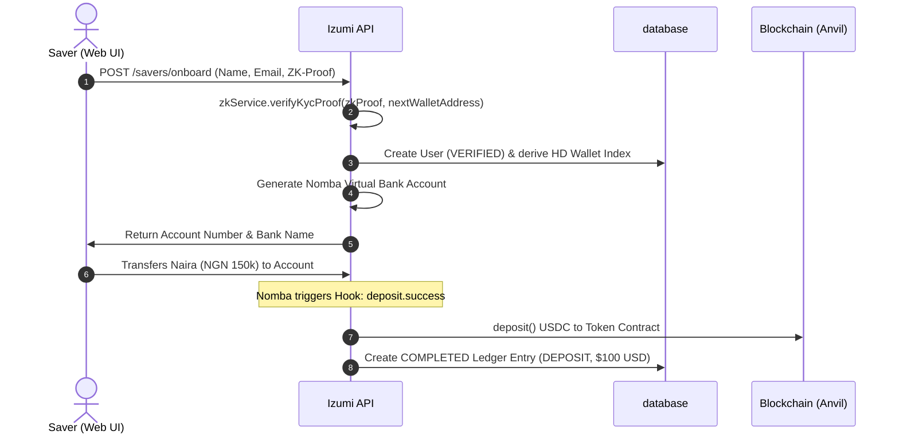
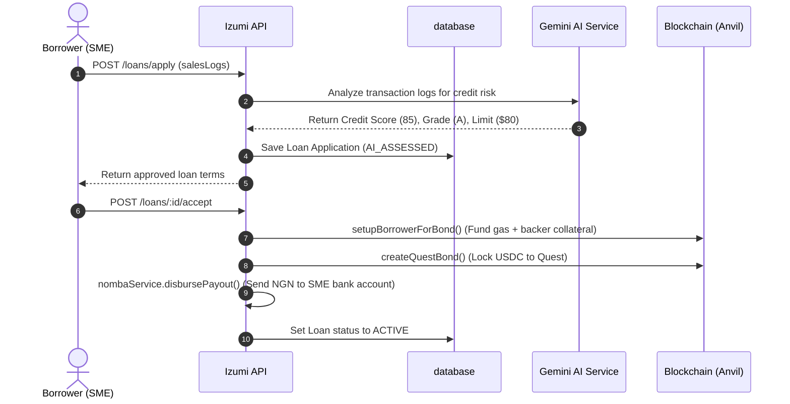
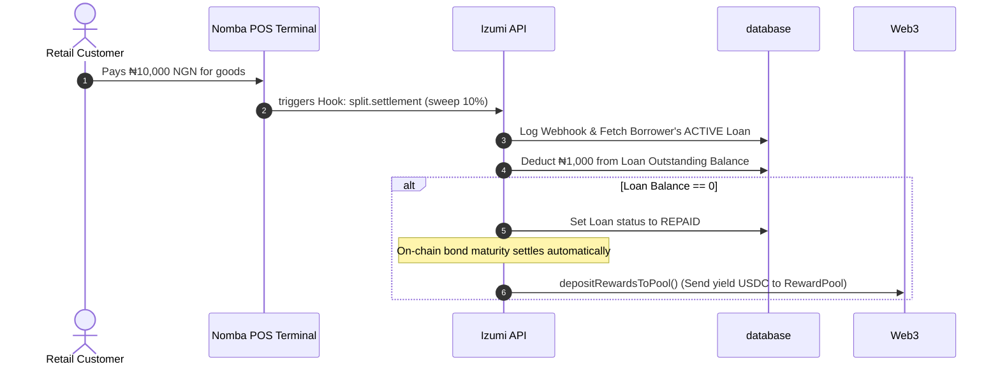

# 🌊 Izumi: Technical Architecture & Developer Handbook

Welcome to the **Izumi** backend. This handbook is designed for frontend and integration engineers to help you understand the architectural decisions, structural components, cryptographic pipelines, and financial flows that power Izumi.

---

## 🧭 1. The Izumi Vision & Product Core

### The Double-Sided Pain Point
1. **The Saver (Freelancers & Retail Savers)**: Faces local currency inflation (30%+ NGN devaluation). Standard USD bank accounts are locked behind high fees and complex bank documentation.
2. **The Borrower (SMEs)**: Small businesses represent the backbone of the economy but are starved of credit. Commercial bank interest rates are predatory (30%–40%+), and they demand physical collateral (like land titles) which SMEs do not own.

### The Web2.5 Hybrid Solution
Izumi bridges this gap by abstracting complex blockchain interactions behind familiar Web2 interfaces (Naira virtual bank accounts and mobile payments). 
* **The Saver** deposits Naira (NGN). Under the hood, this capital is swapped for stable USD on-chain, and deposited into **Yield Vaults**.
* **The Borrower** gets access to low-interest working capital. Under the hood, this loan is backed by a **Credit Bond**. Repayments are automated at the source by sweeping a percentage of their daily POS machine transactions.

```
┌────────────────────────────────────────────────────────────────────────┐
│                          THE LIQUIDITY ENGINE                          │
├────────────────────────────────────────────────────────────────────────┤
│                                                                        │
│   [Savers (NGN)] ───► (Nomba DVA) ───► [Izumi Hot Wallet]              │
│                                              │                         │
│                                       (Swaps NGN/USDC)                 │
│                                              ▼                         │
│   [Yield Vault] ◄─── (USDC) ◄─── [Saver Wallet]                  │
│            │                                                           │
│     (Earns Yield)                                                      │
│            ▼                                                           │
│   [Bond Manager] ──► (Disburses) ──► [Borrower SME (NGN)]        │
│            ▲                                     │                     │
│            │                                (POS Sales)                │
│            │                                     ▼                     │
│   [Split Sweeps] ◄──── (Nomba POS Webhook) ◄─────┘                     │
│                                                                        │
└────────────────────────────────────────────────────────────────────────┘
```

---

## 🏗️ 2. Core Service Directory & Logic

The project isolates its logic into clean, single-responsibility services under `src/services/`.

### 🛡️ A. Cryptographic Privacy: `zk.service.ts`
* **Why**: Financial compliance checks (KYC/KYB) usually require submitting raw government documents (like BVN or TIN) to centralized cloud servers. This poses a massive data leak risk.
* **How**: We implement a simulated **Groth16 zk-SNARK** pipeline.
  * **KYC Proofs**: Prove that a user possesses a valid 11-digit BVN and binds the proof to their derived blockchain wallet. The raw BVN is hashed client-side and never sent to the backend.
  * **Credit Proofs**: Prove that a user has been scored and approved for a specific limit under the protocol’s scoring algorithm.
* **Security Constraints**: 
  > [!IMPORTANT]
  > To prevent parameters manipulation (e.g., an attacker changing their credit limit in the public signals), the verifier enforces that `commitment === HASH(userId + score + limit)` before validating the signature.

---

### ⛓️ B. Blockchain Abstraction: `blockchain.service.ts`
* **Why**: Frontend applications should not force users to pay gas, manage seed phrases, or understand MetaMask.
* **How**: 
  * Uses **Viem** for ultra-fast JSON-RPC interactions with our EVM chains.
  * Dynamically derives child wallets for savers and borrowers using a single master seed and standard HD derivation paths (`m/44'/60'/0'/0/index`).
  * Manages gas sponsorships automatically (deposits ETH and USDC tokens to borrower accounts to establish the collateral backing).
  * **Concurrency Protection**: Implements a TypeScript **Mutex lock** to prevent transaction nonce collisions when multiple deposits or webhooks fire simultaneously.

---

### 🤖 C. Underwriting Engine: `ai.service.ts`
* **Why**: Small merchants do not have audited financial statements or credit history. Their transaction velocity is their credit profile.
* **How**:
  * Accepts raw POS terminal transaction logs.
  * Feeds these metrics (monthly revenue, transaction volume, average ticket size, industry sector volatility, and operating margins) into **Gemini AI** using a structured JSON schema.
  * Gemini assesses the risk profile and returns a structured output containing:
    1. A numerical credit score (`1` to `100`).
    2. A credit grade (`A`, `B`, or `C`).
    3. An approved borrowing limit.
    4. Actionable business tips, strengths, and risks.

---

### 💳 D. Fiat Rails: `nomba.service.ts`
* **Why**: Connects blockchain stablecoins to real-world Nigerian banking networks.
* **How**:
  * **Collections**: Generates unique Dynamic Virtual Accounts (DVAs) for savers to transfer Naira.
  * **Disbursements**: Executes payouts via the Nomba Transfer API to send Naira directly to the borrower's local bank account.
  * **Webhook Sweeps**: Receives real-time hooks from Nomba terminals when card payments occur, sweeping a split percentage to repay active loans.

---

## 📊 3. Database Architecture & Ledger System

We use Prisma with a double-entry accounting ledger pattern to track assets safely.

```
┌────────────────────────────────────────────────────────┐
│                   PRISMA DATA MODELS                   │
├────────────────────────────────────────────────────────┤
│                                                        │
│      ┌──────────┐            ┌──────────────────┐      │
│      │   User   │───────────►│  VirtualAccount  │      │
│      └────┬─────┘            └──────────────────┘      │
│           │                                            │
│           ├───────────────┐                            │
│           ▼               ▼                            │
│      ┌──────────┐    ┌──────────┐                      │
│      │  Wallet  │    │  Ledger  │                      │
│      └──────────┘    └──────────┘                      │
│                           ▲                            │
│                           │                            │
│      ┌──────────┐    ┌────┴─────┐                      │
│      │ Borrower │◄───│   Loan   │                      │
│      └──────────┘    └──────────┘                      │
│                                                        │
└────────────────────────────────────────────────────────┘
```

### The Ledger: `prisma/schema.prisma`
A ledger tracks cashflows via state-machine entries:
* **DEPOSIT**: Saver transfers NGN. The status moves from `PENDING` -> `COMPLETED` once the stablecoin is locked on-chain.
* **WITHDRAWAL**: Saver requests local cash. We burn/withdraw QTK on-chain, disburse Naira via Nomba, and mark the ledger entry as `COMPLETED`.
* **YIELD**: Calculated interest earned from Quest vaults periodically credited to the saver's ledger.

---

## 🔄 4. End-to-End User Flow Walkthrough

Here is the exact lifecycle of how data and money flow through the system:

### 1. Saver Onboarding & Deposit


---

### 2. Borrower Loan Issuance


---

### 3. Automated POS Sweeping Repayment


---

## 📝 5. API Reference & Payload Checklist

This is what you will send and receive from the backend.

### Onboard Saver
* **Endpoint**: `POST /savers/onboard`
* **Request**:
```json
{
  "name": "Chinedu Saver",
  "email": "chinedu@saver.com",
  "zkProof": {
    "pi_a": ["0x98f...", "0x2bc...", "1"],
    "pi_b": [["0x111...", "0x01"], ["0x222...", "0x02"], ["1", "0"]],
    "pi_c": ["0x45a...", "0x3dd...", "1"],
    "publicSignals": ["0x7e53f...", "0xf39fd6e51aad88f6f4ce6ab8827279cfffb92266"]
  }
}
```
* **Response**:
```json
{
  "message": "Saver onboarding and wallet derivation successful",
  "userId": "9b1deb4d-3b7d-4bad-9bdd-2b0d7b3dcb7d",
  "walletAddress": "0xf39Fd6e51aad88F6F4ce6aB8827279cffFb92266",
  "virtualAccount": {
    "accountNumber": "9012345678",
    "bankName": "Nomba Microfinance Bank",
    "accountName": "IZUMI / Chinedu Saver",
    "reference": "REF-SAVER-123456"
  }
}
```

### Apply for Loan (Transaction Ingestion)
* **Endpoint**: `POST /loans/apply`
* **Request**:
```json
{
  "borrowerId": "23a1ef5d-771c-4212-be22-38b4382c4422",
  "amountRequested": 75000,
  "termDays": 30,
  "salesLogs": [
    { "volume": 160000, "txCount": 150 },
    { "volume": 150000, "txCount": 140 }
  ]
}
```
* **Response**:
```json
{
  "message": "Loan application submitted and scored successfully",
  "applicationId": "586eb637-14eb-415a-8a54-9f853f6511eb",
  "status": "AI_ASSESSED",
  "creditAnalysis": {
    "score": 85,
    "grade": "A",
    "maxLimit": 120000,
    "monthlyRepayment": 126000,
    "aiStrengths": ["Consistent revenue growth", "High POS transaction volume"],
    "aiWeaknesses": ["None"],
    "aiTips": ["Maintain current sales volumes"]
  }
}
```

---

## 🛠️ 6. Troubleshooting FAQs for Frontend Devs

* **Q: Why are Prisma amounts returned as strings?**
  * **A**: Prisma's Decimal type maps to Postgres Decimal or string representations in JSON payloads. You must coerce these values into standard floats or integers on the frontend:
    ```javascript
    const balance = parseFloat(payload.balanceUSD);
    ```
* **Q: How does the Hot Wallet operate?**
  * **A**: The server holds a master key (`MNEMONIC` or `PRIVATE_KEY`). It uses this to automatically sign transactions on behalf of users (paying gas under the hood), meaning the saver/borrower doesn't need to connect an external Web3 wallet for core flows.
* **Q: How do we test sweeps locally?**
  * **A**: You can simulate POS transaction sweeps using the `POST /webhooks/nomba` endpoint by passing the reference of a borrower's virtual account.
